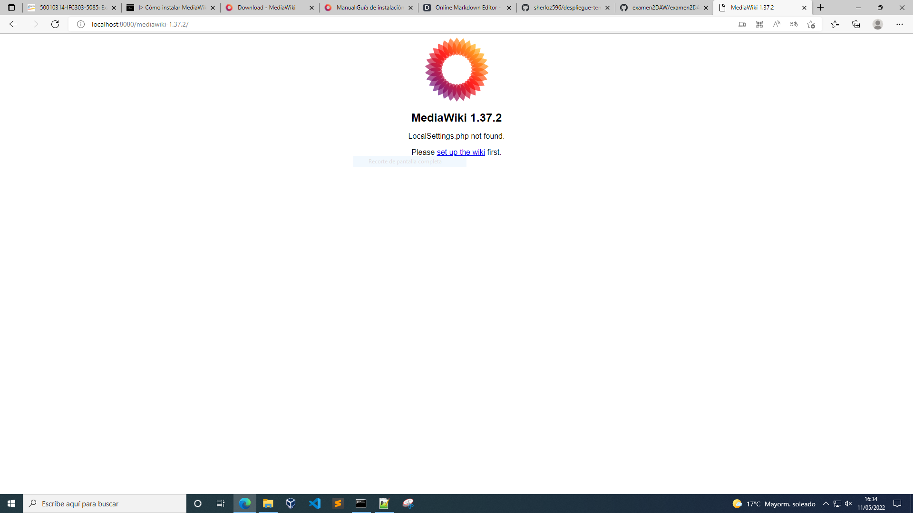
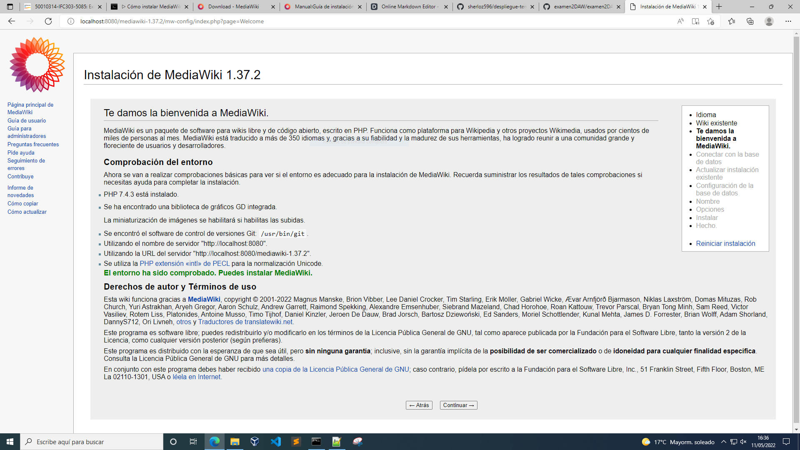
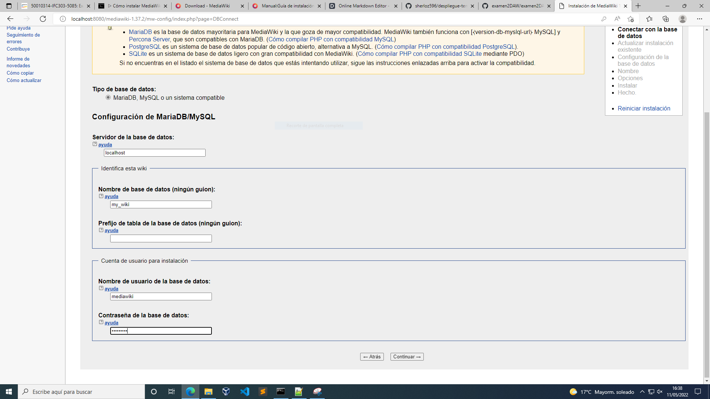
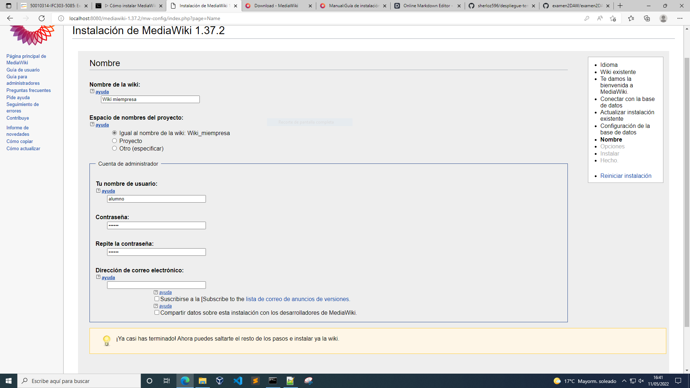
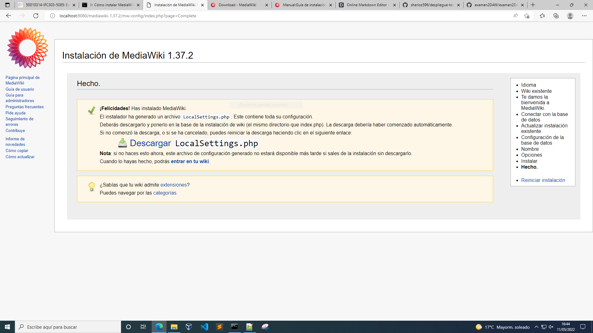
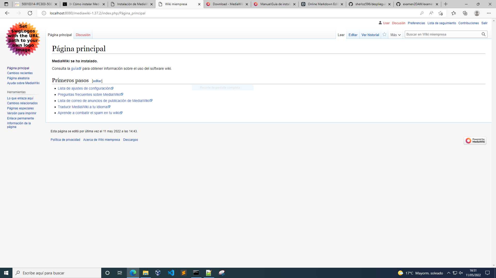
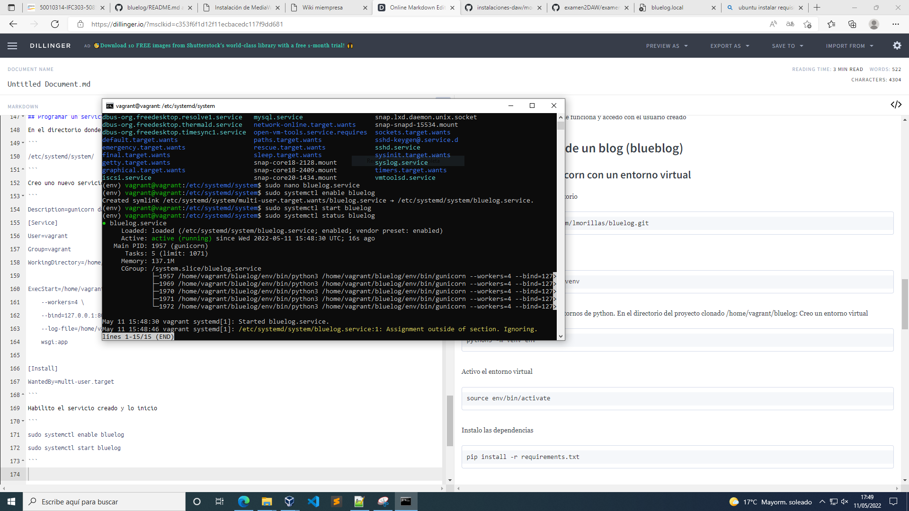
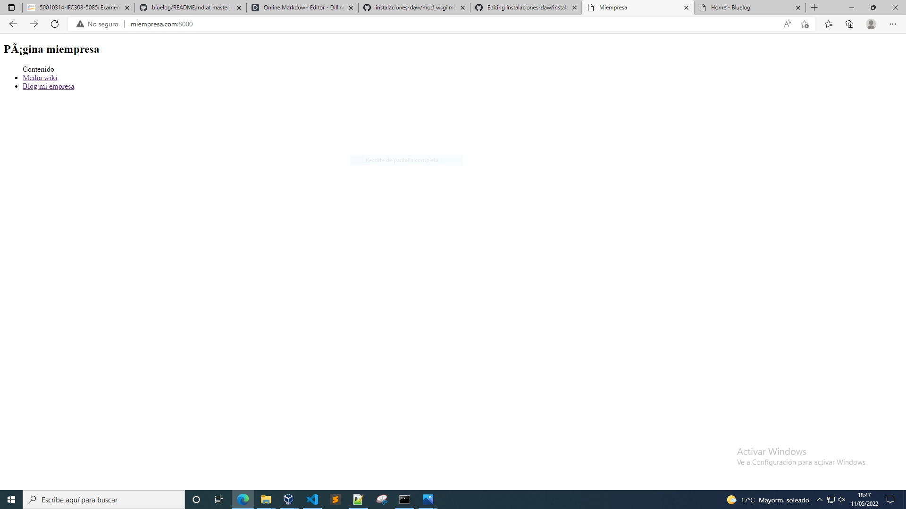
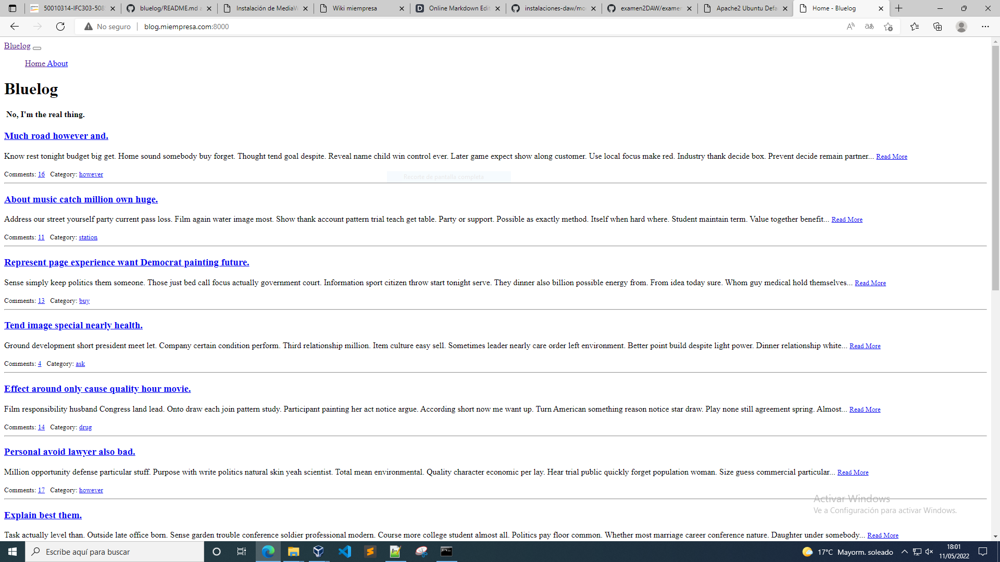

## Web 1: wiki empresarial
Lanzo vagrant con la siguiente configuración
```
Vagrant.configure("2") do |config|
  config.vm.box = "bento/ubuntu-20.04"

  config.vm.network :forwarded_port, guest: 80, host: 8000
end
```
Levanto y actualizo el sistema
```
vagrant up
vagrant ssh
sudo apt update
```
Instalo el servidor de base de datos mariadb
```
sudo apt install mariadb-server
```
Instalo apache2 y el módulo que permite que apache2 interprete PHP
```
sudo apt install apache2 libapache2-mod-php php php-mysql
```
Instalo el cliente de base de datos mariadb 
```
sudo apt install mariadb-client
```
Descargo el paquete con la herramienta wget
```
wget https://releases.wikimedia.org/mediawiki/1.37/mediawiki-1.37.2.tar.gz
```
Descomprimo el paquete
```
sudo tar xf mediawiki-1.37.2.tar.gz -C /var/www/html/
```
 Creo un enlace simbólico sin números de versión
 ```
 sudo ln -s /var/www/html/mediawiki-1.37.3/ /var/www/html/wiki
```
Conecto el servicio de base de datos
```
sudo mysql -u root -p
```
Creo la base de datos
```
create database my_wiki character set utf8mb4 collate utf8mb4_unicode_ci;
```
Creo el usuario
```
create user mediawiki@localhost identified by 'mediawiki';
```
Concedo permisos al usuario sobre la base de datos
```
grant all privileges on my_wiki.* to mediawiki@localhost;
```
Cierro sesión
```
exit
```
Instalo las extensiones de php
```
sudo apt install -y php-apcu php-gd php-imagick php-intl php-mbstring php-xml
```
Recargo apache
```
sudo systemctl reload apache2
```
Accedo al instalador desde el navegador
```
http://localhost:8080/mediawiki-1.37.2/
```
Se abre la página de inicio del instalador correctamente

La instalación comienza correctamente

Introduzco el usuario de la base de datos creado anteriormente

Registro un nombre de usuario

Usuario: user
Contraseña: alumno2022
La instalación se realiza correctamente

Accedo a la wiki con el usuario creado

Una vez finalizada la instalación descargo el archivo de configuración LocalSettings.php y lo muevo a su ubicación definitiva
```
sudo mv LocalSettings.php /var/www/html/mediawiki-1.37.2/
```
Entro en la wiki para comprobar que funciona y accedo con el usuario creado
## Web 2: Instalación de un blog (blueblog)
### Poner en marcha gunicorn con un entorno virtual
En /home/vagrant/ clono el repositorio
```
git clone https://github.com/lmorillas/bluelog.git
```
Instalo el paquete python3.8-venv
```
sudo apt install python3.8-venv
```
Preparo la máquina virtual para entornos de python. En el directorio del proyecto clonado /home/vagrant/bluelog: Creo un entorno virtual
```
python3 -m venv env
```
Activo el entorno virtual
```
source env/bin/activate
```
Instalo las dependencias
```
pip install -r requirements.txt
```
Instalo el servidor web gunicorn
```
pip install gunicorn
```
### Conectar como un proxy gunicorn con Apache
Para hacerlo proxy: Habilito los módulos proxy y reinicio apache
```
sudo a2enmod proxy proxy_http
sudo systemcyl restart apache2
```
Creo un virtual host con la directriz ProxyPass, indicando que todo lo que vaya a la raíz lo coja apache del puerto 8080 que es donde sirve gunicorn
Configuro el sitio para que los datos de los estáticos no los sirva gunicorn y los sirva directamente apache añadiendo la directriz:
```
ProxyPass /static/ !
Alias /static/ /home/vagrant/flask_temperaturas/static
```
También hay que dar permisos al directorio
```
<Directory /home/vagrant/flask_temperaturas/static>
    Require all granted
</Directory>
```
El virtualhost queda de la siguiente manera:
```
<VirtualHost *:80>
        ServerName blog.miempresa.com

        ServerAdmin webmaster@localhost
        DocumentRoot /home/vagrant/bluelog/
        
        ProxyPass /static/ !
        ProxyPass / http://localhost:8080/
        Alias /static/ /home/vagrant/bluelog/static
        
        <Directory /home/vagrant/bluelog/static>
            Require all granted
        </Directory>
</VirtualHost>
```
Habilito el sitio y reinicio apache
```
sudo a2ensite bluelog.conf
sudo systemctl reload apache2
```
## Programar un servicio
En el directorio donde están todos los servicios:
```
/etc/systemd/system/
```
Creo uno nuevo servicio llamado temperaturas.service con la siguiente configuración:
```
Description=gunicorn daemon
[Service]
User=vagrant
Group=vagrant
WorkingDirectory=/home/vagrant/bluelog/

ExecStart=/home/vagrant/bluelog/env/bin/gunicorn \
    --workers=4 \
    --bind=127.0.0.1:8080 \
    --log-file=/home/vagrant/bluelog/gunicorn.log \
    wsgi:app
    
[Install]
WantedBy=multi-user.target
```
Habilito el servicio creado y lo inicio
```
sudo systemctl enable bluelog
sudo systemctl start bluelog
```
Compruebo que el servicio funciona correctamente

Cambio la configuración de vagrant y reinicio la máquina virtual para que todos los accesos sean a través de apache
```
config.vm.network "forwarded_port", guest: 80, host: 8000
```
Reinicio vagrant y compruebo que funciona en la dirección
```
http://blog.miempresa.com:8000/
```
## Página web inicial
Creo los virtual host con los nombres indicados en la tarea y edito el index.html para mostrar el contenido
Edito el index.html para mostrar el contenido de la página

El blog es accesible en la dirección http://blog.miempresa.com:8000/

